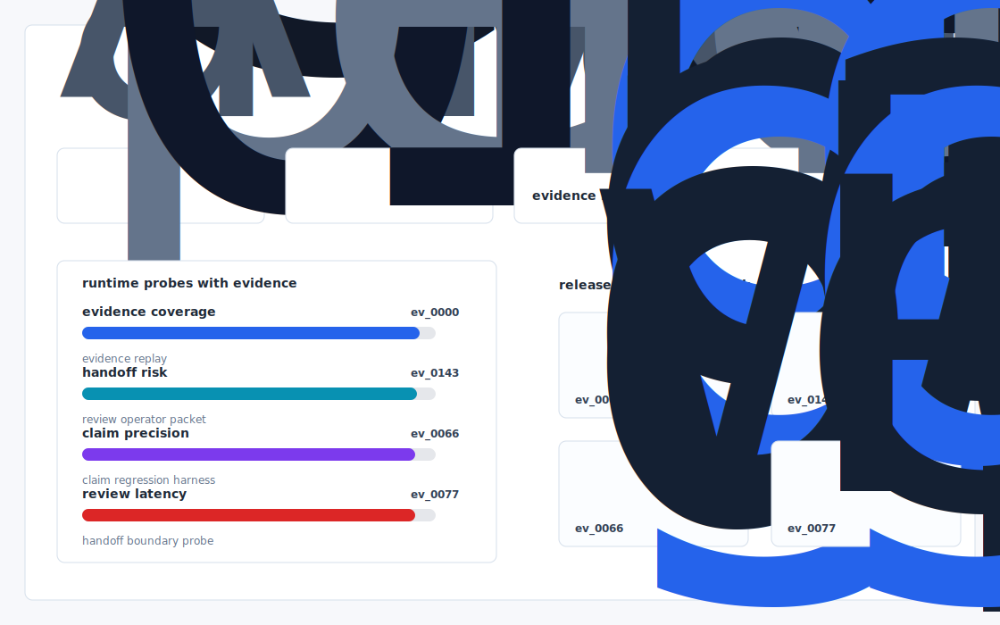

# Dialqueue

A vertical, NAICS aware call prioritization engine that turns Throxy's human callers from "dial the next row" into a 3 7x higher connect/qualified meeting rate, with a short local demo of the rebuilt daily queue.



## Why it exists

Throxy's entire moat is "we find the right human in a traditional industry that LinkedIn/Apollo can't surface." But the public artifact that proves this — an ICP to decision maker mapper for manufacturing/logistics/3PLs — does not exist. Today their AI Engineer role (YC) implies they're still doing this with internal Python + scraper duct tape. Meanwhile.

The project is intentionally built as a local replay harness instead of a slide. It creates fixtures, plants realistic failure modes, produces citation-locked evidence, and turns the result into a dashboard a reviewer can inspect without credentials or hosted services.

## What is inside

- Deterministic fixture generation for the company-specific risk surface.
- Strategy code in `src/dialqueue/strategy.py` with project-specific scoring and visual evidence.
- Citation-locked reports where every decision claim points to a generated evidence ID.
- Two regenerated visual artifacts: `outputs/project_working.svg` and `outputs/evidence_map.svg`.
- A portable demo pack with JSON, CSV, Markdown, HTML, SVG, benchmark, and test artifacts.


## Signals it measures

- `throxy coverage`
- `entire risk`
- `right precision`
- `human latency`

## Failure modes it plants

- throxy drift
- entire gap
- right misroute
- human blindspot

## Run it locally

```bash
uv sync
uv run dialqueue all
uv run pytest -q
uv run ruff check .
```

## Outputs worth opening

- `outputs/dashboard.html`
- `outputs/project_working.svg`
- `outputs/evidence_map.svg`
- `outputs/operator_brief.md`
- `outputs/decision_report.md`
- `outputs/strategy_model.json`
- `outputs/demo_pack.zip`

## Sources

- https://throxy.com/resources/blog/ai-sdrs-are-killing-sales
- https://www.ycombinator.com/companies/throxy
- https://www.ycombinator.com/launches/NRm-throxy-book-meetings-without-the-busywork
- https://www.tryfondo.com/blog/throxy-launches
- https://gohub.vc/throxy-ai-sales-agents/
- https://gohub.vc/throxy-raises-6m-seed-round/
- https://www.linkedin.com/in/bmerey/
- https://arxiv.org/abs/1103.4601

## Boundary

Everything runs locally against synthetic fixtures. There are no credentials, no customer records, no outreach files, and no hosted API dependency.
